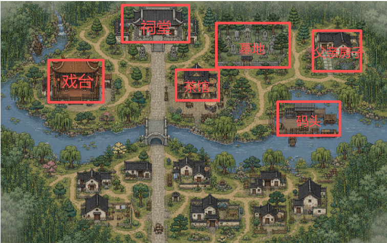

# 梨园生死

> AI Agent 驱动的 2D 开放探索叙事游戏 —— 每一局都是独一无二的故事。


## 作品背景

**梨园生死**是一款由 AI Agent 驱动的 2D 开放探索叙事游戏。玩家扮演归乡的戏班继承人，在江南小镇中自由探索、与 5 个 AI NPC 深度对话、收集关键物品、推进六章剧情，最终做出自己的抉择。

传统叙事游戏的一切剧情、对话、分支都是预设的——玩家只是在已有路径中做选择，重复游玩体验趋同。梨园生死试图打破这个限制：开发者只提供微剧本骨架（章节标题、NPC 人设、场景定义），由 AI 实时生成对话、任务和剧情走向。每一次游玩，NPC 会根据你的态度做出不同回应，剧情会因你的选择走上不同方向，结局由整局累积的关系和行为共同塑造——**没有攻略，没有最优解，每局都是独一无二的。**

## 核心玩法

### 开放探索

江南小镇地图包含街道、河道、石桥等地形，6 个可进入的室内场景，每个场景有独立地图、可交互物品和驻场 NPC。

| 场景 | 描述 |
|------|------|
| 戏台 | 戏班传承之地，新旧交替 |
| 茶馆 | 小镇消息汇聚之处 |
| 码头 | 来往过客，暗藏秘密 |
| 祠堂 | 家族记忆的守护者 |
| 父亲故居 | 尘封往事的起点 |
| 墓地 | 故事的开始，也是归宿 |



### AI 对话

5 个核心 NPC 由 AI 实时扮演，根据章节进度、历史事件、与玩家的关系值动态生成对话。支持流式输出和物品展示交互——同一个 NPC 在不同对局中会表现出完全不同的行为。


### 章节推进

六章剧情由 AI 渐进式生成任务。NPC 通过投票决定章节推进，让故事自然发展而非机械打勾。

| 章节 | 标题 |
|------|------|
| 序章 | 回乡 |
| 第一章 | 回响 |
| 第二章 | 探寻 |
| 第三章 | 记忆 |
| 第四章 | 见证 |
| 第五章 | 传承 |

### 物品与存档

10 件剧情物品可发现、收集、展示给 NPC。6 个存档槽位支持完整的游戏状态保存与恢复。

## 技术亮点

### AI 驱动的动态叙事

游戏没有预写对话树。NPC 的每一句回复、每一个章节的任务、每一段物品的发现描述、最终的结局文本——全部由 AI 根据玩家当前的游戏状态实时生成。每局游戏的故事都是独一无二的。

### NPC 是"活人"

5 个核心 NPC 有独立的人设和性格，AI 根据当前章节、历史事件、与玩家的关系值动态决定他们的回应和态度。同一个 NPC，在不同玩家的对局中会表现出完全不同的行为——你对他好，他可能倾囊相授；你惹怒了他，他可能拒绝帮你。

### 关系驱动结局

通关时的结局不是 A/B 选择的结果，而是整局游戏中所有对话、选择、行为累积塑造的。AI 会回顾全程关键事件，生成专属的结局标题、人生哲言，以及每个 NPC 根据与你关系而定的个人终章。

### 渐进式剧情生成

游戏启动时 AI 生成五章大纲，每完成一章再根据实际游玩结果生成下一章详细内容。前章的所作所为直接影响后章的剧情走向，形成真实的因果链。

### 完整可玩

从主菜单到结局画面，所有系统（对话、探索、物品、存档、子场景、章节推进、结局生成）均已完整实现，可以直接体验完整的一局游戏。

## 技术栈

| 层 | 技术 |
|----|------|
| 前端 | Phaser 3 + Vite + Vanilla JS |
| 后端 | Python + FastAPI + Uvicorn |
| AI | 腾讯 MaaS LLM（SSE 流式输出） |
| 数据 | SQLite + JSON 存档 |
| 部署 | 前后端分离，单机运行 |

## 快速开始

### 环境要求

- Node.js 18+
- Python 3.10+
- 腾讯 MaaS API Key

### 启动后端

```bash
cd backend
pip install -r requirements.txt
cp .env.example .env   # 编辑 .env 填入 TENCENT_LLM_API_KEY
python main.py          # 启动后端，端口 8000
```

### 启动前端

```bash
cd frontend
npm install
npm run dev             # 启动开发服务器
```

浏览器打开前端地址即可开始游戏。

## 项目结构

```
backend/
├── main.py              # FastAPI 入口
├── config.py            # NPC 定义、关系值、地图参数
├── routes/              # API 路由（dialogue / game / chapter / item / archive）
├── agents/              # AI Agent 层（NPC 对话、任务规划、剧本生成）
├── state/               # 游戏状态管理（会话、章节引擎、阶段引擎）
├── storage/             # SQLite + JSON 存档
├── llm/                 # LLM HTTP 客户端
└── prompts/             # 系统 Prompt 文件

frontend/src/
├── main.js              # Phaser 游戏入口
├── config.js            # 游戏常量
├── api/                 # 后端 API 客户端 + SSE 流式解析
├── scenes/              # Phaser 场景（Boot / Menu / Game / UI）
└── scenes/modules/      # 功能模块（对话、子场景、存档、背包、音乐等）
```

## 未来愿景

梨园生死不仅是一个游戏，更是一套 **AI 叙事游戏框架**。当前的实现验证了核心可行性——AI 可以实时编排剧情、扮演 NPC、生成结局。在此基础上，我们规划了以下方向：

- **场景与世界观可扩展**：场景和物品可持续添加，AI 自动规划新剧本
- **剧本可插拔**：换微剧本文件即可演绎完全不同的故事
- **AI 生成微剧本**：根据主题自动生成微剧本，降低创作门槛
- **NPC 社会关系网**：NPC 之间也有恩怨情仇，让世界自己运转
- **叙事导演 AI**：总导演逻辑把控节奏，保证戏剧张力
- **玩家创作社区**：微剧本编辑器 + 分享平台，从单机进化为叙事内容平台

我们的目标不是做一款游戏，而是探索一种新的叙事范式——**叙事的上限不再是开发者的写作上限，而是 AI 与玩家共同创造的上限。**

## License

MIT
