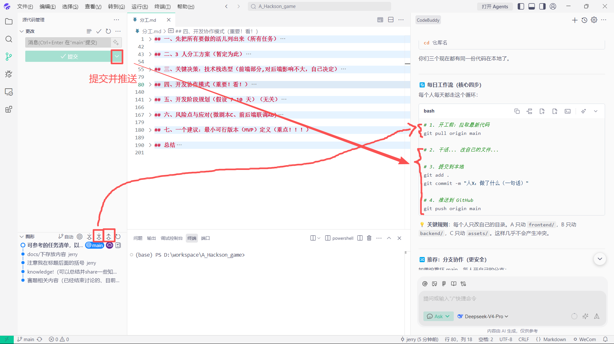

# 🚀 GitHub 协作实战指南

> 三人黑客松团队 Git 协作流程，只讲实际会用到的命令。

---

## 前置条件（只需做一次）

### 1. 仓库所有者添加协作者

```
GitHub 仓库页面 → Settings → Collaborators → Add people
输入队友的 GitHub 用户名，发送邀请
```

队友收到邮件后，**点击接受邀请**才能 push。

### 2. 队友克隆仓库到本地

```bash
git clone https://github.com/你的用户名/仓库名.git
cd 仓库名
```

三人现在都有同一份代码在本地了。

---

## 🔄 每日工作流（核心四步）

```bash
# 1. 开工前：拉取最新代码
git pull origin main

# 2. 干活... 改自己的文件...

# 3. 提交到本地
git add .
git commit -m "人X：做了什么（一句话）"

# 4. 推送到 GitHub
git push origin main
```

> 💡 **关键规则**：每个人只改自己的目录。A 只动 `frontend/`，B 只动 `backend/`，C 只动 `assets/`。这样几乎不会产生冲突。

---



## 🔀 分支协作（更安全，推荐）

```bash
# 开工：从最新的 main 开分支
git checkout main
git pull origin main
git checkout -b feature/人X-功能名

# 干完活推送
git add .
git commit -m "功能描述"
git push origin feature/人X-功能名

# 去 GitHub 网页上点 "Create Pull Request" → 合并到 main
```

> 黑客松时间紧，目录不冲突的话直接 push main 也完全够用。

---

## ⚠️ 冲突了怎么办？

万一两个人改了同一个文件：

```bash
# 当 push 被拒时
git pull origin main        # 先拉取
# 如果有冲突，VSCode 会标出来
# 手动解决冲突 → 保存
git add .
git commit -m "解决冲突"
git push origin main
```

---

## 📋 常用命令速查

| 目标 | 命令 |
|------|------|
| 拉最新代码 | `git pull origin main` |
| 看改了啥 | `git status` |
| 提交所有改动 | `git add .` → `git commit -m "xxx"` |
| 推送到远程 | `git push origin main` |
| 看提交历史 | `git log --oneline -10` |
| 临时保存改动 | `git stash` → 恢复用 `git stash pop` |
| 放弃本地改动 | `git checkout -- 文件名` |

---

## 🎯 本项目目录协作策略

```
仓库/
├── frontend/    ← 只有 A 改
├── backend/     ← 只有 B 改
├── assets/      ← 只有 C 改
├── docs/        ← 共享文件（谁都可以改）
├── knowledge/   ← 共享知识文件
└── 分工.md      ← 共享文件
```

### 范例：典型的一天

```
上午 9:00  → 三人各自 git pull origin main （同步起点）

下午 3:00  → 人B 完成了 NPC 对话 API
            git add backend/
            git commit -m "B: 完成 NPC 对话 API 接口"
            git push origin main

下午 3:05  → 人A 要联调了
            git pull origin main   ← 拿到 B 刚推的代码

下午 5:00  → 人C 画好了两个 NPC 的 tile
            git add assets/
            git commit -m "C: 更新老票友+茶楼老板娘 tile"
            git push origin main

下午 5:10  → 人A 拉取
            git pull origin main   ← 拿到新的 tile 资源
```

---

## 🤖 进阶：GitHub Issues 跟踪进度

在 GitHub 仓库网页上 → Issues → New Issue：

- A 提：`「前端」对话 UI 流式输出`
- B 提：`「后端」Agent 对话 API 返回 options`
- 做完后在 commit 里写 `fixes #1`，自动关闭 Issue

---

## 📌 总结

- **每天开工先 `pull`，收工记得 `push`**
- **各改各的目录，冲突几乎不会发生**
- **commit message 写清楚谁做了什么**
