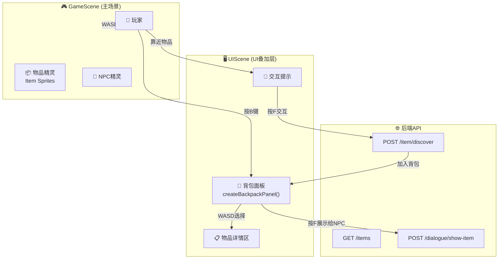

The user wants to implement an inventory/backpack system for the game. Let me first understand the current codebase structure before providing a detailed plan. I need to:

1. Understand the current game architecture (scenes, player interaction, item system)
2. Check if there's already any inventory/backpack related code
3. Look at the existing UI scene structure
4. Understand the current interaction system (F key interaction)

Let me explore the codebase first.
好的，让我先深入了解当前项目的代码结构，尤其是物品交互、UI系统、场景管理等方面，然后再给出完整的背包系统设计方案。
Let me now explore the key files to understand the game architecture better:
1. GameScene.js - to understand item interaction (F key), player movement (WASD)
2. UIScene.js - to understand the UI system
3. Backend item routes and data models
4. The story items YAML
Now let me look at the backend side to understand the inventory/item system, and the API client to see what item-related APIs exist:
Let me also check the backend item system and API client to have a complete picture:
Now let me also check the backend session manager to understand the inventory data structure, and the API design doc for item-related endpoints.
Let me also look at the backend session state and the API design doc for completeness:
Now let me also check the dialogue.py show-item route to understand how item showing works with NPCs:
Let me check the show-item dialogue route and the backend's main item data model:
Let me search more specifically for the NarrativeItem class in session.py.
Now I have a comprehensive picture of the codebase. Let me summarize what I've found:

1. **GameScene.js**: 
   - Player controlled by WASD, F key used for NPC dialogue interaction
   - There's an `inputLocked` flag for input control
   - Items are not yet placed on the map as interactable objects (only NPCs currently)
   - `interactHint` shows F key hints near NPCs

2. **UIScene.js**:
   - Already has `this.inventory = []` and `this.keyI` key binding
   - Has `keyF` and handles it in update() for dialogue closing
   - Has the dialog panel, options, text streaming, etc.
   - Has `showItemToNpcStream` import (but not used yet visibly in UI)
   - Input handling: F for dialogue close, H for history, ESC for menus
   - Already has `items` in the API client imports

3. **Backend**:
   - `GET /api/game/{session_id}/items` - returns inventory + scene_items
   - `POST /api/game/{session_id}/item/discover` - discover item, add to inventory
   - `POST /api/dialogue/show-item` - show item to NPC (SSE stream)
   - `NarrativeItem` has `holdable: bool = True` (most items can be picked up)
   - Items have `location` with scene and position coordinates

4. **API Client**:
   - `getItems(sessionId)` - already exists
   - `showItemToNpcStream(sessionId, npcId, itemId, playerMessage)` - already exists

5. **Story Items** (YAML):
   - Items with `acquire_method` like "在父亲旧居墙角的老木箱中找到（F键打开木箱）"
   - Items have `location` with `scene` and `position` (col, row)
   - Some items are `holdable: false` (scene interactable but not collectable)

Now let me plan the backpack/inventory system. The user's requirements:
1. Press B to open/close backpack
2. Player presses F to interact with items and obtain them (put in backpack)
3. Open backpack to see obtained items
4. WASD can control item selection in backpack
5. Focus on current item shows item info
6. They want my suggestions too

Let me think about the full plan:

### Analysis of Current State
- Already have `inventory` state in UIScene
- Already have `keyI` for items (unused), but user wants B key instead
- Already have `showItemToNpcStream` API 
- F key is currently only for NPC dialogue - need to add item interaction
- Items have `location.position` (col, row) - we can place items on the map!
- GameScene currently only checks NPC proximity for F key

### Proposed Plan

**Phase 1: Place items on the map (GameScene)**
- Read scene items from API/game state
- Create item sprites at their position coordinates (like NPCs)
- Add proximity detection for items (similar to NPC proximity)
- When near an item + F pressed → call discover API → add to inventory

**Phase 2: Backpack panel (UIScene)**
- Create backpack panel (overlay, like history panel)
- Toggle with B key
- Display items in a grid layout
- WASD navigation for item selection
- Show item details when focused

**Phase 3: Item info display**
- When an item is focused, show its description, key status, related NPCs, etc.

Let me also think about some suggestions:
1. Since items have `location.scene`, we need to map scenes to our single map - perhaps items only appear on the main map
2. Some items are `holdable: false` - they should show description on F but not be collected
3. Could use item icons/sprites instead of just text
4. Backpack could show item count and categorization

Now let me write the plan:
现在我已经对项目有了全面的了解。让我来总结现状并给出完整的背包系统设计方案。

---

## 现状分析

经过代码审查，当前项目已有以下基础：

| 已有能力 | 位置 | 状态 |
|----------|------|------|
| `this.inventory = []` 状态 | `UIScene.js:51` | 已有，但未使用 |
| `this.keyI` (I键) 绑定 | `UIScene.js:66` | 已有，但无对应面板 |
| `getItems(sessionId)` API | `api/client.js:492` | 已实现 |
| `showItemToNpcStream()` API | `api/client.js:436` | 已实现 |
| `POST /api/game/{id}/item/discover` | `backend/routes/item.py` | 后端已支持 |
| 物品 YAML 定义（含坐标、描述） | `story_items.yaml` | 物品含 `location.position` 坐标 |
| `NarrativeItem.holdable` 字段 | `backend/state/session.py:169` | 区分可拾取/不可拾取 |
| F键交互（仅限NPC） | `GameScene.js:982` | 需要扩展 |

**缺失部分**：
1. 地图上没有物品实体（物品有坐标但没有精灵渲染）
2. 没有背包 UI 面板
3. F 键只能对话 NPC，不能与物品交互
4. 没有物品详情展示
5. 没有 WASD 在背包内导航选择

---

## 背包系统设计方案

我建议按以下层次实现，下面用 Mermaid 图说明整体架构：



### 核心设计思路

#### 1. 地图物品精灵 (GameScene)

物品在 `story_items.yaml` 中已有 `location.position` (col, row) 坐标。需要在 GameScene 中为**当前章节可见的物品**生成精灵：

- 调用 `getItems()` 获取 `scene_items` 列表（后端已按章节过滤）
- 为每个场景物品创建小的像素精灵（如宝箱图标 `📦`），放置在格子坐标
- 玩家接近物品时显示 `[F] 拾取/查看` 提示
- 按 F 键调用 `POST /api/game/{id}/item/discover`
- 可拾取的物品加入背包，不可拾取的只显示旁白

#### 2. 背包面板 (UIScene)

参考已有的 `createHistoryPanel()` 模式，新建 `createBackpackPanel()`：

```
┌──────────────────────────────────┐
│      —— 行囊 ——                  │ ← 标题栏
│──────────────────────────────────│
│  📦 孩童戏服    📦 手抄剧本      │ ← 物品网格 (2列)
│  📦 童年合影    📦 柳家族谱      │
│                                  │
│──────────────────────────────────│
│  ▶ 孩童戏服                       │ ← 详情区
│  一件小号的戏曲戏服，红底金线...   │
│  [关键道具] [关联: 陈师傅, 老周]  │
│──────────────────────────────────│
│  [B] 关闭  [WASD] 移动  [F] 展示  │ ← 操作提示
└──────────────────────────────────┘
```

- **按 B 键**：打开/关闭背包（取代现有的 keyI）
- **WASD 导航**：在物品网格间移动焦点光标
- **焦点物品**：下方详情区实时显示物品名称、描述、是否为关键道具、关联NPC
- **F 键展示**：如果当前正在与 NPC 对话，可以向 NPC 展示焦点物品（调用 `showItemToNpcStream`）
- **关闭背包**：再次按 B 或 ESC

#### 3. 输入优先级

当前 F 键在多个场景中有冲突，需要明确的优先级：

| 优先级 | 场景 | F键行为 |
|--------|------|---------|
| 1 | 背包打开中 | 展示物品给 NPC / 无操作 |
| 2 | 对话框激活中 | 翻页 → 关闭对话 |
| 3 | 靠近物品 | 拾取/查看物品 |
| 4 | 靠近NPC | 触发对话 |
| 5 | 无目标 | 无操作 |

B 键同样需要处理：背包打开时再按 B 关闭，对话中按 B 不触发背包。

### 改进建议

除了你的需求，我还建议：

1. **物品稀有度/类型视觉区分**：关键道具(`is_key: true`)用金色边框，普通道具用银色边框
2. **获得物品的 Toast 动画**：从物品位置飞入背包图标的小动画
3. **背包物品可直接展示给 NPC**：当与 NPC 对话时打开背包，选中物品按 F 即可展示（调用已有的 `showItemToNpcStream`），这对接了现有的对话系统
4. **B 键替代 I 键**：比 I 键更顺手，单手 WASD+B/F 覆盖全部背包操作
5. **ESC 键统一关闭**：背包、历史面板、暂停菜单、对话框都支持 ESC 关闭

### 实现步骤总览

| 步骤 | 文件 | 内容 |
|------|------|------|
| **S1** | `GameScene.js` | 添加物品精灵创建、接近检测、F键拾取逻辑 |
| **S2** | `UIScene.js` | 新建 `createBackpackPanel()` 背包面板 UI |
| **S3** | `UIScene.js` | W-A-S-D 选择逻辑 + 详情显示 |
| **S4** | `UIScene.js` | B 键绑定 + 输入优先级协调 |
| **S5** | `api/client.js` | 添加 `discoverItem()` API 函数 |
| **S6** | `UIScene.js` | 物品 → NPC 展示功能（对接已有 `showItemToNpcStream`） |
| **S7** | `GameScene.js` | 获得物品的 Toast 飞入动画 |

---

你觉得这个方案如何？有几个问题想确认：

1. **B 键替代 I 键**可以吗？（B 在左手 WASD 区域，操作更流畅）
2. 背包中按 **F 展示物品给当前对话的 NPC** 这个功能要不要一起做？（后端 API 已就绪）
3. 物品精灵用**小图标文字**（如 📦 🎭 📖 📷）还是用**像素图形绘制**？考虑到美术资源还没有，建议先用 emoji 文字做占位。