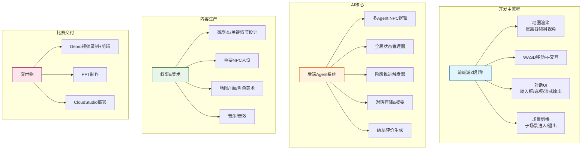
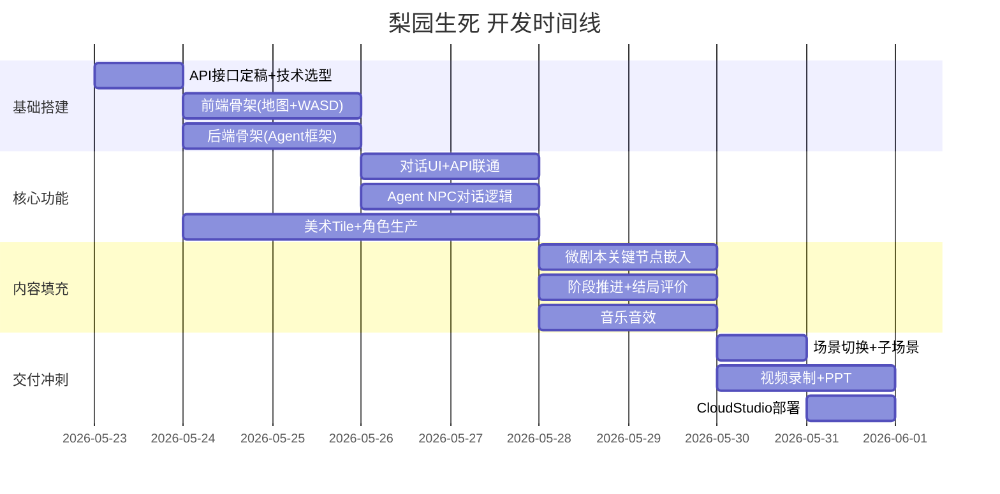

## 一、先把所有要做的活儿列出来（所有任务）

根据你的梳理 + 现有设计文档 + 赛题要求，整个项目可以拆成以下工作包：



---

## 二、3 人分工方案（暂定为此）

核心原则：**每个人一条线，交叉点用 CodeBuddy 补位**。

| 角色 | 代号 | 主责 | 工作内容 | 技术栈/工具 |
|------|------|------|----------|------------|
| **A** | 🖥️ 前端引擎手 | 游戏客户端 | ① 地图渲染（星露谷倾斜视角 tile map）<br/>② WASD 移动 + 碰撞检测 + F 键交互触发<br/>③ 场景切换逻辑<br/>④ 对话 UI（手动输入 / AI 选项 / 流式展示）<br/>⑤ 角色/NPC 精灵动画 | Phaser 3 / Godot（导出 HTML5）<br/>Tiled Map Editor |
| **B** | 🧠 AI 架构师 | 后端 + Agent 系统 | ① 多 Agent NPC 架构设计<br/>② LLM API 对接（Agent 调用 + 对话生成）<br/>③ 全局状态管理器（阶段判定、触发器）<br/>④ 对话存储 + 关键节点摘要<br/>⑤ 结局评价生成 Prompt<br/>⑥ 前后端 API 接口设计 | Python/FastAPI<br/>腾讯云 LLM API<br/>数据库（SQLite/轻量级） |
| **C** | 🎨 内容导演 | 叙事 + 美术 + 交付 | ① 微剧本设计（关键情节节点）<br/>② 重要 NPC 人设卡（个性、背景、台词风格）<br/>③ **AI 生成美术资产**（tile、角色、场景图）<br/>④ AI 生成音乐/音效<br/>⑤ Demo 视频录制 + 剪辑<br/>⑥ PPT 制作<br/>⑦ 部署上线 | AI 绘图工具<br/>AI 音乐工具<br/>Tiled / Aseprite<br/>剪辑软件 |

---

## 三、关键决策：技术栈选型（前端部分,对后端影响不大，自己决定）

在分工前需要敲定几个技术选型，否则会影响协作接口：

### 1. 游戏引擎选哪个？

| 选项 | 优点 | 缺点 |
|------|------|------|
| **Phaser 3** | Web 原生、浏览器即跑、生态成熟、tilemap 支持好 | 纯 JS/TS，大型项目可能吃力 |
| **Godot 4** | 编辑器强大、tilemap 一流、可导出 HTML5 | HTML5 导出偶有兼容问题 |
| **PixiJS** | 渲染性能顶级、轻量 | 不是游戏引擎，需要手写很多逻辑 |

> **建议：Phaser 3**。理由：黑客松时间紧，Phaser 的 tilemap + arcade physics 开箱即用，且浏览器原生部署，不需要额外导出步骤。

### 2. 星露谷倾斜视角怎么实现？

本质上是 **2.5D oblique projection**（斜 45° 投影），有两种路线：

- **路线 A（推荐）**：用 Tiled Map Editor 绘制 tile map，导出 JSON，Phaser 直接加载。美术资源做成 45° 倾斜 tile（如 Stardew 那样）。
- **路线 B**：纯代码做等距投影变换，不需要倾斜 tile，但透视效果打折扣。

> **建议**：路线 A，人 C 用 AI 生成倾斜 tile 素材 → 人 A 在 Phaser 里加载渲染。

---

## 四、开发协作模式（重要！看！）

### 4.1 数据接口约定（协作契约,还需敲定）

前端（A）和后端（B）之间需要非常清晰的 API 契约。建议**第一天就敲定接口文档**：

```yaml
# 核心 API 示例
POST /api/dialogue
  body: { npc_id, player_input?, selected_option? }
  response: { npc_response (streaming), available_options[] }

GET /api/game_state
  response: { current_stage, relationship_map, key_events[] }

POST /api/trigger_event
  body: { event_id }
  response: { stage_change?, new_music?, new_tint? }

GET /api/evaluate_ending
  response: { ending_type, summary_text, key_highlights[] }
```

### 4.2 美术资产管线（前端---美术）

人 C 产出的美术资源 → 人 A 直接引用。约定好：

- Tile 尺寸：如 `32x16` 或 `64x32`（倾斜视角的 tile 尺寸）
- 文件命名规范：`tile_grass.png`, `npc_old_actor.png`, `bg_teahouse.png`
- 存放路径：统一在 `assets/` 目录下

### 4.3 Prompt 协作（美术---后端）

人 B 负责 Prompt 工程，但 **NPC 的人设、台词风格** 由人 C 提供。可以约定一个 NPC 人设卡模板：

```markdown
## NPC: 老票友 陈伯
- 年龄：72
- 性格：怀旧、感伤、外冷内热
- 口头禅："当年你爹唱《牡丹亭》的时候……"
- 对话风格：半文半白，爱引用戏词
- 阶段一态度：对你爱答不理，"又是个不懂戏的"
- 阶段二态度：开始讲戏班往事
- 阶段三态度：拿出珍藏的行头，希望你留下
```

### 4.4 Git 协作流（同一github项目协作尝试）

```
main
├── frontend/      (人 A)
├── backend/       (人 B)
└── assets/        (人 C)
```

- PR 最小粒度，每人每天至少一次 merge
- 用 GitHub Issues 跟踪任务
- 每日站会（哪怕 10 分钟）同步进度

---

## 五、开发阶段规划（假设 7-10 天）（无关）



---

## 六、风险点与应对(微剧本C、前后端联调AB)

| 风险 | 等级 | 应对 |
|------|------|------|
| **美术量太大** | 🔴 高 | 全部用 AI 生成，不手绘；tile 只做必要的几种 |
| **Agent 对话延时** | 🟡 中 | 用流式输出 + loading 动画缓解体感；普通 NPC 用本地对话库秒回 |
| **前后端联调卡壳** | 🟡 中 | 第一天就写好 Mock 数据，前端可以先不连后端开发 |
| **星露谷视角实现难度** | 🟡 中 | 先做纯俯视 2D 跑通，再替换倾斜 tile 素材升级视角 |
| **微剧本写不完** | 🟢 低 | 关键是 3 个关键情节节点（阶段切换点），其余交给 AI 生成 |
| **Demo 视频没时间** | 🟡 中 | 开发过程中就录屏，最后只需剪辑串联 |

---

## 七、一个建议：最小可行版本（MVP）定义（重点！！！）

不要一上来就追求完美，先定义 MVP：

> **MVP 的标准**：玩家能用 WASD 在小镇上走动 → 找到 2 个重要 NPC → 和其中 1 个进行 AI 对话 → 感受到阶段变化的差异 → 触发 1 个结局。

在此基础上再往上加内容。**哪怕只有茶馆+戏台两个地点、2-3 个重要 NPC，只要能跑通 Agent 对话+阶段推进的完整链路，就是一个合格的参赛作品。**

---

## 总结

| 人的维度 | 你刚才提出的关注点 |
|----------|------------------|
| 人 A（前端）覆盖 → | 前端地图渲染（星露谷视角）、WASD 控制 |
| 人 B（后端）覆盖 → | 多 Agent NPC 逻辑设计 |
| 人 C（内容）覆盖 → | 美工、音乐、微剧本情节、视频 demo、PPT |

我的核心建议是：
1. **第一天敲定 API 接口文档 + 美术规格**，这是协作的生命线
2. **先做 MVP 再堆内容**，确保比赛前能跑通完整闭环
